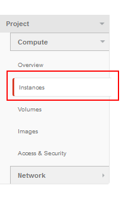
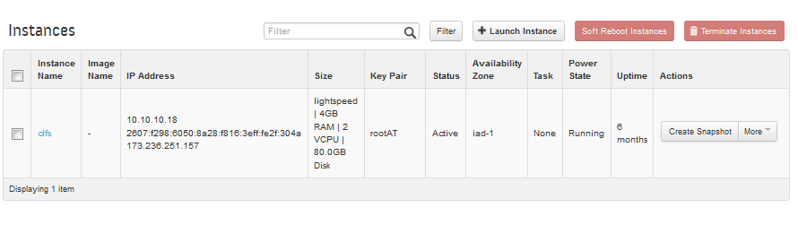
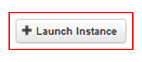
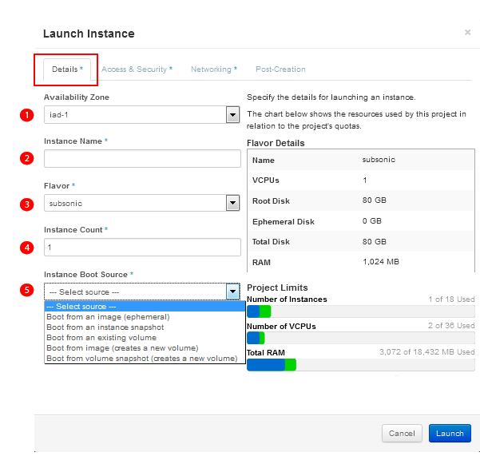
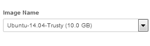
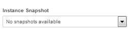
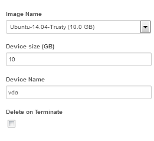
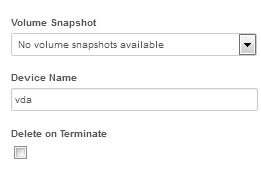

================================
Managing Instances in the Web UI
================================

The dashboard page is located under the Project -> Compute ->
`Instances <https://dashboard.dreamcompute.com/project/instances/>`_ page,
and is your one-stop shop where you can create, reboot, terminate, and manage various aspects of your instances.

Viewing Instances
~~~~~~~~~~~~~~~~~

:Once you have logged into the DreamCompute dashboard, click the
**Instances** tab in the left-hand panel under Project -> Compute.

*The Instances page appears.*

Launching an Instance
~~~~~~~~~~~~~~~~~~~~~

To launch an instance, click the '''+ LAUNCH INSTANCE''' button on the 
right side.  When the Launch Instance dialog box opens, configure your 
instance by making selections within the following tabs.

Details tab
-----------

+---------------+-----------------------+--------------------------------------------------------------------------------+
| Field Number  | Field Name            | Action and Description                                                         |
+---------------+-----------------------+--------------------------------------------------------------------------------+
|    |num1|     | **Availability Zone** | Shows the available zone(s)                                                    |
+---------------+-----------------------+--------------------------------------------------------------------------------+
|    |num2|     | **Instance Name**     | Enter a unique name to make it easier to identify the instance and its purpose |
+---------------+-----------------------+--------------------------------------------------------------------------------+
|    |num3|     | **Flavor**            | Select from a list of pre-defined                                              |
|               |                       | instance sizes.  The flavors are listed in increasing order of vCPU and memory |
|               |                       | provided.  Selecting a flavor will update the flavor details box and project   |
|               |                       | limits (quota) below it.                                                       |
+---------------+-----------------------+--------------------------------------------------------------------------------+
|    |num4|     | **Instance count**    | Enter an instance count. Default is 1, but can be increased for more rapid     |
|               |                       | deployment of multiple instances configured similarly.                         |
+---------------+-----------------------+--------------------------------------------------------------------------------+
|    |num5|     | **Instance Boot**     | Select an instance boot source from the following five options.                |
|               | **Source**            |                                                                                |
|               |                       | - **Boot from an image (ephemeral)** -- Select from a list of images to        |
|               |                       |   boot an ephemeral instance:                                                  |
|               |                       |                                                                                |
|               |                       |   |images|                                                                     |
|               |                       |                                                                                |
|               |                       | - **Boot from an instance snapshot** -- Select from a list of instance         |
|               |                       |   snapshots to boot an ephemeral instance:                                     |
|               |                       |                                                                                |
|               |                       |   |snapshots|                                                                  |
|               |                       |                                                                                |
|               |                       | - **Boot from an existing volume** -- Select from a list of volumes:           |
|               |                       |                                                                                |
|               |                       |   |volumes|                                                                    |
|               |                       |                                                                                |
|               |                       | - **Boot from image (creates a new volume)** -- Select Image Name, Device      |
|               |                       |   Size (GB), Device Name (default is "vda"), and Delete on Terminate checkbox: |
|               |                       |                                                                                |
|               |                       |   |images2|                                                                    |
|               |                       |                                                                                |
|               |                       | - **Boot from volume snapshot (creates a new volume)** -- Select a Volume      |
|               |                       |   Snapshot from the drop-down list, Device Name (default is "vda"), and Delete |
|               |                       |   on Terminate checkbox:                                                       |
|               |                       |                                                                                |
|               |                       |   |snapshots2|                                                                 |
|               |                       |                                                                                |
+---------------+-----------------------+--------------------------------------------------------------------------------+

.. |num3| image:: images/3callout.png

.. |volumes| image:: images/Details-3-boot-from-volume.fw.png

