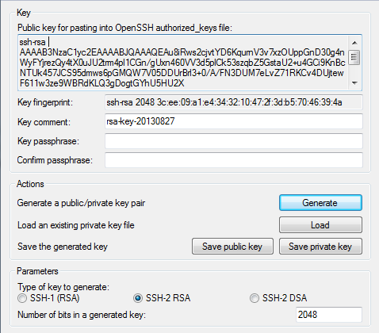

=======================================
How to upload an SSH key via the web UI
=======================================

DreamCompute utilizes ssh keys for accessing your instances, instead of using
passwords alone.  This is done for increased security and simplifies managing
users for OpenStack (the public key is injected into the instance at boot).
This prevents needing to modify files or passwords on the operating system on
startup.

SSH keypairs are managed on the
`Access & Security - Keypairs <https://dashboard.dreamcompute.com/project/access_and_security/?tab=access_security_tabs__keypairs_tab>`_
section of the dashboard.

SSH Key Components
~~~~~~~~~~~~~~~~~~

There are two parts to an SSH key: a private key and a public key.  The private
key is known only to you and should be safeguarded.  On unix-based systems such
as Mac and Linux, the private key is generally stored in:

.. code-block:: bash

    /home/myuser/.ssh/id_rsa

The public key can be shared with any server that you would like ssh access
to.  Similarly, the public key will be stored in:

.. code-block:: bash

    /home/myuser/.ssh/id_rsa.pub

SSH keys generated on Windows systems using the
`PuTTY <http://www.chiark.greenend.org.uk/~sgtatham/putty/>`_ key generator
(puttygen.exe) are not stored in a uniform location, but instead where the
user chooses to save them.

Create a new SSH key
~~~~~~~~~~~~~~~~~~~~

via the DreamCompute dashboard
------------------------------

The easiest way to generate a key is to have DreamCompute generate one for
you.  You can do this by going to the DreamCompute
`Access & Security - Keypairs <https://dashboard.dreamcompute.com/project/access_and_security/?tab=access_security_tabs__keypairs_tab>`_
dashboard.  On the top right, click the "Create
Keypair" button, give the key a name, and click "Create Keypair".  Your
browser will start downloading the private key named the same as they name
given with a .pem file extension.  Save this file for later user as your
id_rsa private key file.

via puttygen.exe
----------------

This program can be downloaded from the
`PuTTY <http://www.chiark.greenend.org.uk/~sgtatham/putty/>`_ website.  After
running the program, click on the "generate" button, and follow the
instructions to generate random data.  When complete, you can click the "save
private key" button to save the .ppk (PuTTY Private Key File) file for use
with PuTTY later.  The text at the top labeled "Public key for pasting into
OpenSSH authorized_keys file" can be copy/pasted into a text file for
importing into the DreamCompute dashboard and other future uses.  The "save
public key" button saves a modified version of the public key that won't
directly import into the DreamCompute dashboard.  Save these files in a safe
location.  The final step is to continue to the
Import an Existing section to import the key into DreamCompute.

Here is an example of the puttygen.exe program:

via ssh-keygen
--------------

This program can be found on Mac, Linux and other unix-based operating
systems.

When run:

STEP 1: Enter a file name to save private key to (**hit enter for the
recommended default that you see in parenthesis**).

STEP 2: Enter a password (recommended). You can press enter twice to not have
a password.

The output looks like this:

.. code-block:: bash

    $ ssh-keygen -t rsa
    Generating public/private rsa key pair.
    Enter file in which to save the key (/home/myuser/.ssh/id_rsa):
    Enter passphrase (empty for no passphrase):
    Enter same passphrase again:
    Your identification has been saved in /home/myuser/.ssh/id_rsa.
    Your public key has been saved in /home/myuser/.ssh/id_rsa.pub.
    The key fingerprint is:
    66:d9:a4:f0:8d:0b:72:93:b8:67:2e:af:f6:91:ce:e3 myuser@mycomputer
    The key's randomart image is:
    +--[ RSA 2048]----+
    |                 |
    |                 |
    |      .   .      |
    |     . + B       |
    |    o = S o      |
    |     + * .       |
    |    . = .        |
    |    o*..         |
    |   ..*E.         |
    +-----------------+

The final step is to continue to the
Import an Existing SSH Key section to import the key
into DreamCompute.

Checking For An Existing Key
~~~~~~~~~~~~~~~~~~~~~~~~~~~~

For a Windows system, there isn't an easy way to find
where keys were generated or stored.  A private key
generated from puttygen.exe is saved with the .ppk file
extension, but the other files it generates has no
default extension.  You could search your system for
.ppk files and perhaps find your public key in the same
location.

On Mac and Linux systems, you can check in the above
described location:

.. code-block:: bash

    $ ls ~/.ssh/id_rsa*
    /home/myuser/.ssh/id_rsa  /home/myuser/.ssh/id_rsa.pub

Import an Existing SSH key into the Dashboard
~~~~~~~~~~~~~~~~~~~~~~~~~~~~~~~~~~~~~~~~~~~~~

Find the public key file, and open it to copy its
contents.  Next, go to the DreamCompute
`Access & Security - Keypairs
<https://dashboard.dreamcompute.com/project/access_and_security/?tab=access_security_tabs__keypairs_tab>`_
dashboard and click on
"Import Keypair".  Give it a name and paste in the
contents of your public key, then click "Import
Keypair" to save it.

.. meta::
    :labels: ssh key keys ssh-keys
