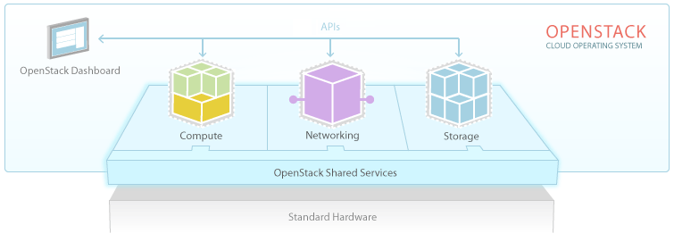

====================
What is DreamCompute
====================

DreamHost's DreamCompute is a cloud computing service that provides scalable
compute resources for developers and entrepreneurs. DreamCompute is based on
OpenStack and designed for scalability, resiliency, and security.

With DreamCompute you can select the amount of compute resources and storage
resources needed and define your own virtual networks.

Service Highlights
~~~~~~~~~~~~~~~~~~

OpenStack
---------

DreamCompute is powered by OpenStack which is a widely adopted, open source
cloud computing platform. It is used by both public cloud hosting companies,
like DreamHost, and for private internal clouds as well.

Compute
-------

DreamCompute provides virtual servers through the use of the
`KVM hypervisor <http://www.linux-kvm.org/>`_. Virtual machines (VMs) can be
started by creating an Instance using the DreamCompute dashboard. Each instance
is based on a Flavor. Flavors define the amount of resources allocated to the
VM in terms of vCPUs, memory, and boot volume size. DreamCompute provides
Flavors small enough for companies just starting out to large ones for
companies with greater computing needs.

Network
-------

Networking services for DreamCompute are delivered through OpenStack's
`Neutron service <http://wiki.openstack.org/Neutron>`_, coupled with
`VMWare's NSX <http://www.vmware.com/products/nsx>`_ (Network Virtualization
Platform), and DreamHost's own `Akanda <https://github.com/dreamhost/akanda>`_
project.

VMWare's NSX, in concert with OpenStack Neutron, provides the ability to create
private networks per tenant with high availability and network hardware
independence. VMWare's NSX virtualizes the network; the software does for
networks what hypervisors do for servers.

Another component to DreamCompute networking is the open source Akanda project
developed by DreamHost. Akanda serves as a network traffic router (OSI Layer 3)
for virtual networks created in DreamCompute. Akanda allows virtual networks to
be configured to talk to each other, to LANs, to WANs or to the Internet.

The combination of Neutron, NSX and Akanda bring a level of network flexibility
and security that sets DreamCompute apart from the competition.

Storage
-------

Storage in DreamCompute is implemented with `Ceph <http://ceph.com/>`_.  Ceph is a
massively scalable, distributed, redundant storage technology that can be
delivered using standard server hardware. OpenStack's
`Cinder <http://wiki.openstack.org/Cinder>`_ project integrates with Ceph for
block storage using Ceph's RADOS Block Device (RBD) software.

Ceph is software created by DreamHost founder Sage Weil and has been under
development inside DreamHost for several years. Ceph has been open source since
its inception, and in early 2012, a new company called `Inktank
<http://www.inktank.com/>`_ was spun out of DreamHost to support and continue development of the
technology. Inktank was then acquired by Red Hat in April 2014.

Ceph is also the foundation for DreamHost's cloud storage service
DreamObjects.

Dashboard
---------

The DreamCompute dashboard is built with OpenStack's
`Horizon <http://wiki.openstack.org/Horizon>`_ project. The dashboard provides a
user interface for interacting with DreamCompute's three main services:
Compute, Networking, and Storage.  Functions such as launching an instance,
creating storage volumes, and configuring a virtual network, as well as
creating and managing snapshots of both a running instance and storage volumes,
can all be done in the dashboard.

Automation APIs
---------------

OpenStack, and therefore DreamCompute, has a whole host of APIs that can be
used for system automation. More about OpenStack APIs can be found here:
http://docs.openstack.org/api

FAQ
~~~

How do I sign up?
-----------------

DreamCompute is in open beta and your first month of the 2GB plan is free. If
you've already got a DreamHost account then you can sign up from your
`Control Panel <http://panel.dreamhost.com/dreamcompute>`_. If not, sign up from
our site - http://www.dreamhost.com/cloud/dreamcompute

What are the pricing plans?
---------------------------

We took a different approach to pricing from other cloud providers, too - by
using quotas. That means that you can launch as many instances as you’d like,
create block storage devices, and allocate public IPs so long as you stay
within the resource caps of the quota. It allows for a lot of flexibility
without having to guess what your bill will be at the end of the month.

DreamCompute has three simple pricing plans with a flat monthly fee, so no more
confusing invoices or bills. Prices start at only $19/month.

Where are the data centers located?
-----------------------------------

DreamHost cloud services are currently located in the United States, but
accessible from anywhere globally.  DreamCompute Beta is located in our
Ashburn, Virginia (US-East) datacenter, and DreamObjects is located in our
Irvine, California (US-West) datacenter.

Will DreamCompute scale?
------------------------

Yes. You can scale your apps both vertically and horizontally, by creating VMs
with additional resources, or by spinning up additional VMs to handle similar
or diverse infrastructure workloads (e.g. creating multiple load balancers, or
separating web servers and databases). The unique networking features in
DreamCompute enable developers and operations teams to design sophisticated
n-tier architectures, with many VMs.

What other Cloud Services is DreamHost working on?
--------------------------------------------------

DreamHost is an active member of the OpenStack open source community, and
contributes code and resources to ensure that it serves our customers. In
addition, we are continually working to ensure that DreamCompute,
DreamObjects, and our future cloud services give developers and
entrepreneurs the tools they need to succeed.

Can I scale my disk volume on a running instance?
-------------------------------------------------

You can scale your disk volumes that are in use if you use
`LVM <http://tldp.org/HOWTO/LVM-HOWTO/>`_ (Logical Volume Manager). We recommend
using LVM when mounting your disk volumes for this reason. LVM allows you to
continually add more disk space without any service interruption.  If you don't
use LVM you would need to mount another (larger) volume, then copy your data
from the old to the new volume.

Can I scale my CPU or memory on a running instance?
---------------------------------------------------

If you wish to add more memory or vCPU capacity to an instance, you will need
to start a new larger instance.  First, take a snapshot of your current
instance, then start a new larger instance based on that snapshot.

Is my data backed up?
---------------------

DreamCompute block storage is based on Ceph which is highly scalable,
redundant, and self-healing storage technology. Ceph is designed to deliver
extreme durability of data, by creating and managing replicas of your data that
are intelligently distributed across zones in our data centers. The system
automatically detects potential corruption of data or potential failure or
degradation of any storage node, and immediately creates new replicas from
redundant data copies, delivering enterprise-grade durability. During the Beta
period, we recommend that you take a regular snapshot of your disk volume as a
back up, which can be stored locally.

.. meta::
    :labels: nova glance keystone akanda neutron network dashboard
             horizon quota billing
