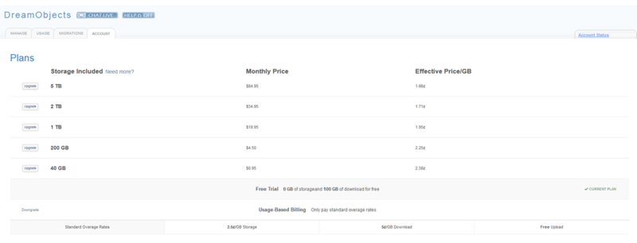

==================
Account Management
==================

Overview
~~~~~~~~

The Account Management tab on the (`Panel > ‘Cloud Services’ > ‘DreamObjects’ <https://panel.dreamhost.com/index.cgi?tree=cloud.objects&>`_) page helps you review the current plan you’re on, quickly pick the plan that's best for you, or cancel your DreamObjects service.

.. note:: You can only access this page if you're the owner of the account where the DreamObjects service was added. No other customers, regardless of access privilege levels, are able to manage your DreamObjects service in the DreamHost panel.**

Choose the plan that's right for you
~~~~~~~~~~~~~~~~~~~~~~~~~~~~~~~~~~~~

The more you store, the less you'll pay per gigabyte.

* When you decide on which plan fits your needs, click the **Upgrade** button to the left of it. Then, confirm the change in the dialog box that opens up.

When do the changes to my plan take effect?
~~~~~~~~~~~~~~~~~~~~~~~~~~~~~~~~~~~~~~~~~~~

* If you are decreasing the amount of storage you need, the changes to your bill occur at the start of the next billing cycle.
* If you are increasing from a less expensive plan to a more expensive one, the difference is charged immediately.

Canceling DreamObjects
~~~~~~~~~~~~~~~~~~~~~~

To cancel DreamObjects:

.. figure:: images/01_DHO_Account_Management.fw.png

* Click the **Cancel DreamObjects** button at the bottom of the page. You are then guided through canceling DreamObjects process.
