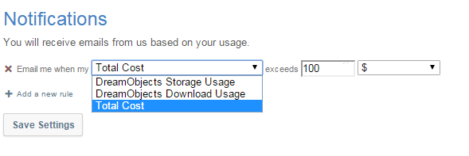

==============================================
How to monitor usage and costs of DreamObjects
==============================================

Overview
~~~~~~~~

The Usage Report tab in the panel provides billing and storage details relating
to your current DreamObjects service plan.

Viewing usage reports
~~~~~~~~~~~~~~~~~~~~~

1. Navigate to the (`Panel > 'Cloud Services' > 'DreamObjects'
   <https://panel.dreamhost.com/index.cgi?tree=cloud.objects&>`_) page in the
   panel.

    .. figure:: images/01_DHO_usage.fw.png

2. Click the 'USAGE' tab.

    **Several graphs appear that illustrate your storage and billing details:**

    .. figure:: images/02_DHO_usage.fw.png

Scheduling notifications
~~~~~~~~~~~~~~~~~~~~~~~~

You can also create rules to schedule notifications when your usage reaches a
specific threshold. You can add as many rules as you like:

Downloading your usage report
~~~~~~~~~~~~~~~~~~~~~~~~~~~~~

Under the 'Usage Report' section, you can create and download a report based on
the following:

* Monthly Billing
* DreamObjects Daily Usage
* DreamSpeed Daily Usage

.. figure:: images/04_DHO_usage.fw.png

You can then choose a username and time frame to view the report. If the
'Monthly Billing' option is selected, the User and Timeframe sections are left
out.

.. meta::
    :labels: quota billing
