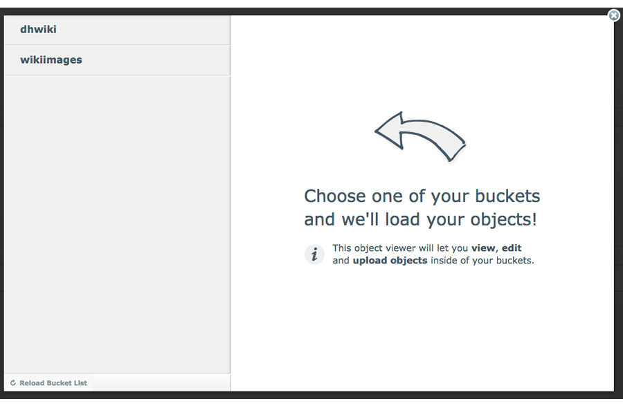
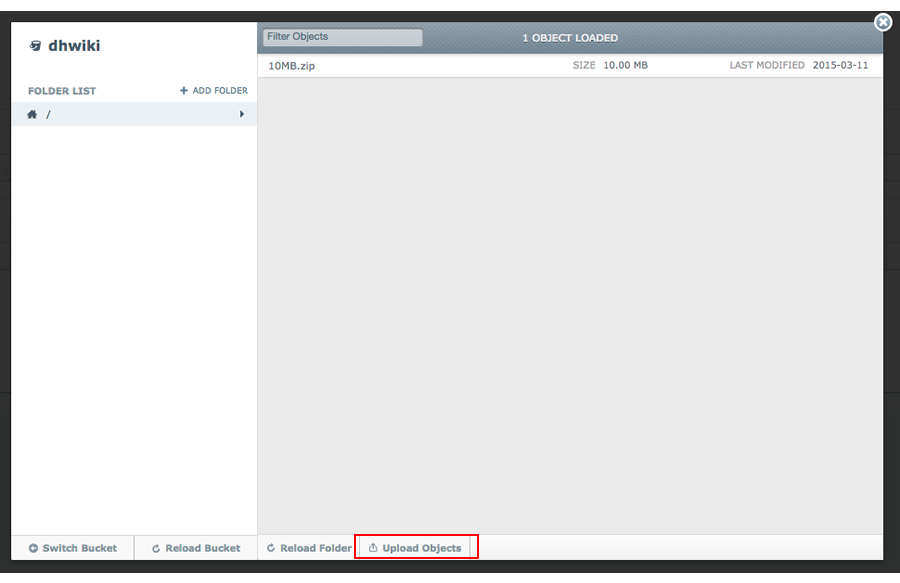
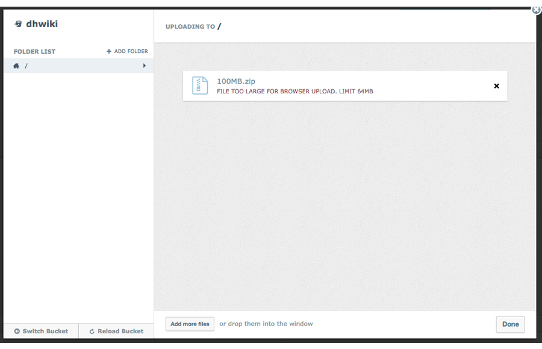
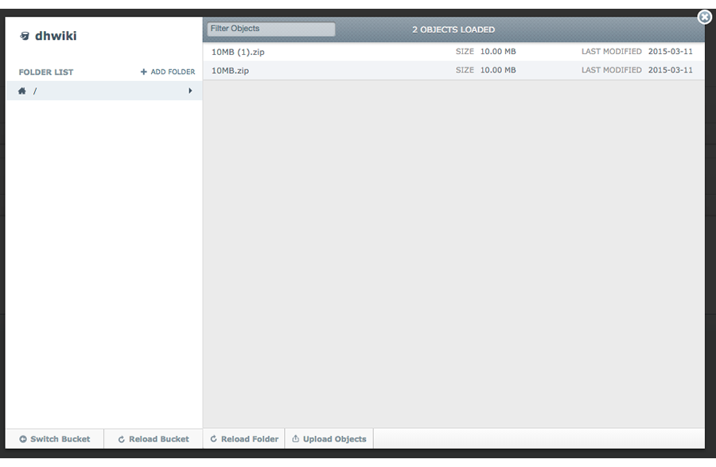

=========================================
Uploading a file from the DreamHost panel
=========================================

There are a variety of applications that allows you to upload and manage your data stored in DreamObjects. The DreamObjects Viewer inside the DreamHost panel provides a way to upload data to DreamObjects using your browser.

**Note: Uploads from your browser are limited in size to 64MB.**

1. Navigate to the (`Panel > Cloud Services > ‘DreamObjects’ <https://panel.dreamhost.com/index.cgi?tree=cloud.objects>`_) page.

.. figure:: images/01_DHO_Panel_Upload.fw.png

2. Locate the User that contains the bucket you wish to work with, and then click the **View Objects** button.
    *The available buckets appear in the following window:*

3. Select the bucket that you’d to which you wish to upload objects.
    *You’ll see the objects currently in the bucket in the following window. An Upload Objects button appears at the bottom of the Object Browser.*

* The Object Browser is now ready for uploading.

.. figure:: images/04_DHO_Panel_Upload.fw.png

4. Drag your files into the Object Browser or click **Select Files** to choose files using the file browser.
    *If your file is larger than 64MB, you’ll see a warning message that indicates that the file is too large:*

5. To copy another file, drag it into the window or click the **Add more files** button at the bottom. 
    *Your upload progress is shown:*

.. figure:: images/06_DHO_Panel_Upload.fw.png

* You can upload additional files during the current upload simply by clicking and dragging the files into the window.

.. figure:: images/07_DHO_Panel_Upload.fw.png

6. When finished uploading, click the **Done** button on the bottom right.

    *The file now appears in the Object Viewer.*

7. Click the **Switch Bucket** button at the bottom to return to the Object Browser main page.

.. figure:: images/09_DHO_Panel_Upload.fw.png

8. To close the DreamObjects view window when you're done, click the grey **X** in the upper right corner. 

.. meta::
    :labels: firefox chrome safari browser desktop upload download
