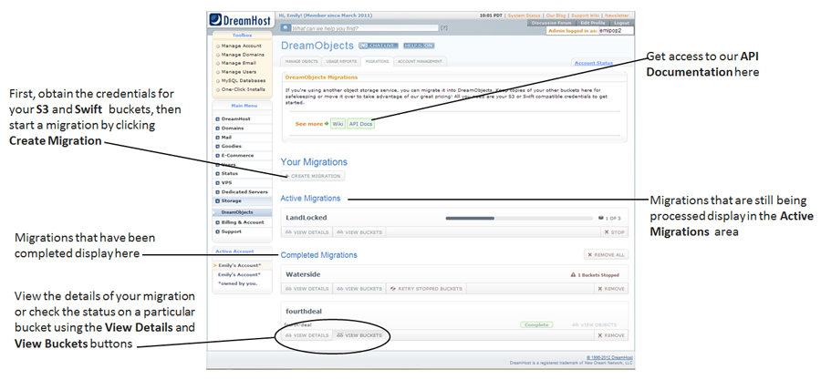
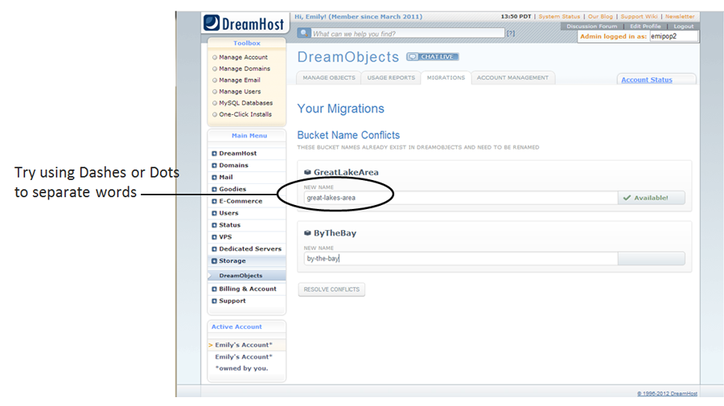
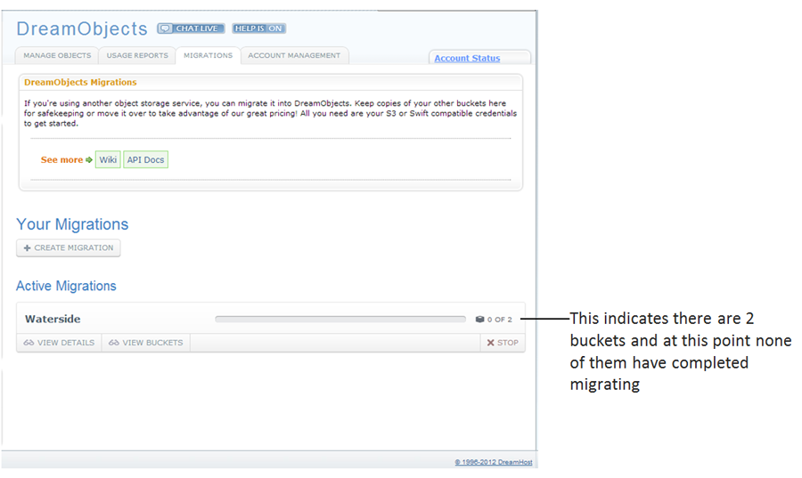
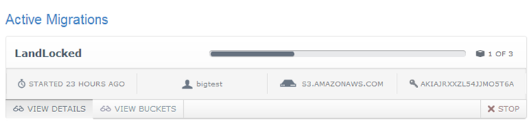
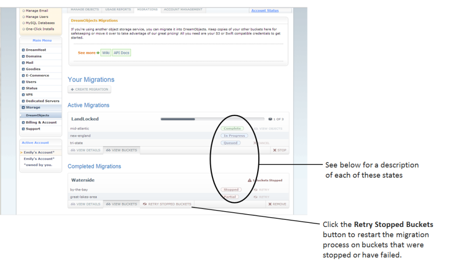

What are Buckets in DreamObjects and How Do You Use Them?
=========================================================

Buckets
~~~~~~~

A Bucket is a mechanism for grouping objects in DreamObjects, similar to a
folder. Unlike a folder, Buckets exist in a global namespace inside
DreamObjects, which means that bucket names must be unique, just like a domain
name, since they are used to create public URLs to store objects.

Creating a Bucket
-----------------

1. Navigate to the (`Panel > ‘Could Services’ > ‘DreamObjects’
   <https://panel.dreamhost.com/index.cgi?tree=cloud.objects&>`_) page in your
   DreamHost panel.

2. Click the ‘Manage’ tab at the top.

    *The DreamObjects page opens where a list of Users is displayed on the
    'Manage' tab:*

    .. figure:: images/12_DHO_End_User_Guide.fw.png

3. Under your username, click the **Add Bucket** button.
    *The 'bucket_name' field box appears:*

    .. figure:: images/13_DHO_End_User_Guide.fw.png

4. Enter a name for your bucket in the Bucket Name field box.
5. Click the **Add Bucket** button.

.. note::

    Bucket names must include at least 3 characters and can only contain
    lowercase characters, numbers, dashes, dots, and underscores. Certain
    symbols and symbol combinations such as dashes or double-dots will break
    DNS on your bucket name, reducing the bucket's functionality, and are not
    recommended.

Selecting a permission setting for your bucket
----------------------------------------------

You can set your new bucket to have public or private permissions. To do
select a permission setting, you must edit the bucket:

1. Navigate to the (`Panel > ‘Could Services’ > ‘DreamObjects’
   <https://panel.dreamhost.com/index.cgi?tree=cloud.objects&>`_) page in your
   DreamHost panel.

    .. figure:: images/01_DreamSpeed_CDN.fw.png

2. Click the ‘Change Settings’ link to the right of your bucket.

    *A pop-up box displays:*

    .. figure:: images/02_DreamObjects_CNAME.png

3. Select a permissions setting for the contents of your bucket by clicking the
   Permissions toggle button.

    * Choose either Private or Public.
    * You can change the permission setting at anytime after creating the
      bucket.

.. note::

    Public means that it is possible to view the Bucket properties and a
    list of the contents of the bucket by navigating to the Bucket URL.
    Although you will be able to see that an object is listed as part of the
    contents of a Bucket, the actual Object cannot be read unless it has also
    been marked Public.

Editing a Bucket
----------------

Options for editing a Bucket are limited, but you can:

* Modify the permissions settings on an existing Bucket at any time.
* Add or remove contents from a Bucket.

.. note::

    It is not possible to change a bucket name or transfer the bucket to
    another user.

Deleting a Bucket
-----------------

1. Navigate to the (`Panel > ‘Could Services’ > ‘DreamObjects’
   <https://panel.dreamhost.com/index.cgi?tree=cloud.objects&>`_) page in your
   DreamHost panel.
2. Click the ‘Manage’ tab.
3. Click your username.

    *The page expands and displays your Keypairs and Buckets:*

    .. figure:: images/17_DHO_End_User_Guide.fw.png

4. To the right of your bucket, click the **Remove Bucket** button.

     *A confirmation dialog box appears:*

    .. figure:: images/18_DHO_End_User_Guide.fw.png

5. Click the **Remove** button to delete the bucket.

.. important::

    Deleting a bucket deletes all objects within the bucket. Make sure
    you have backed up all data in the bucket before deleting.

Understanding the Migrations Page
---------------------------------

The DreamObjects Migrations Tab makes it easy to copy buckets or containers
from other object storage services supporting S3 or Swift compatible APIs.



Creating a migration from an S3 account
^^^^^^^^^^^^^^^^^^^^^^^^^^^^^^^^^^^^^^^

1. Locate your Access Key and Secret Key from the
   `Amazon Web Services Security Credentials
   <http://docs.aws.amazon.com/AWSSecurityCredentials/1.0/AboutAWSCredentials.html>`_
   page on the Amazon S3 site.
2. Navigate to the (`Panel > ‘Could Services’ > ‘DreamObjects’
   <https://panel.dreamhost.com/index.cgi?tree=cloud.objects&>`_) page in your
   DreamHost panel.
3. Click the ‘Migrations’ Tab.

    *In the picture below, no migrations have been attempted:*

    .. figure:: images/16_DHO_End_User_Guide.fw.png

4. Click the **Create Migration** button.

    *Several fields display and a Choose Buckets button appears:*

    .. figure:: images/Mig3.png

5. Enter your S3 Access Key in the Access Key field, and your S3 Secret Key in
   the Secret Key field.

6. Click the **Choose Buckets** button.

    *A list of your S3 Buckets opens. By default, all of the buckets are
    highlighted in blue with a black check mark indicating that they are
    selected:*

    .. figure:: images/Mig4.png

7. Enter a name for your migration in the Name field above the buckets.
   The name is for your use only. If you don't enter a name, one is
   automatically generated and assigned to your migration.

8. Click to select or deselect the buckets you wish to migrate, or use the
   **Select All** or **Select None** buttons.

9. Click the **Start Migration** button.

    *A green bar appears at the top of the screen indicating that your migration
    is successfully added:*

    .. figure:: images/Mig5.png

    *You are returned to the main page of the Migrations tab, and your active
    migration displays in the Active Migrations section of the page.*

Bucket naming convention conflicts
``````````````````````````````````

If the naming conventions used for your S3 buckets or Swift Containers are not
compatible with the naming conventions for DreamObjects, a Bucket Name
Conflicts screen appears:



.. note::

    Currently, Bucket names using capital letters cannot be imported because
    capital letters can create DNS issues. If you have S3 Buckets or Swift
    Containers that use capital letters, you are asked to change their names.
    If you wish, you can use dashes (as pictured above) or dots to separate
    words.

* To avoid any issues, modify your bucket names to resolve any naming conflicts
  and then click the **Resolve Conflicts** button.

    *You are returned to the main page of the Migrations Tab, and your active
    migration displays in the Active Migrations section of the page until it
    completes:*

Viewing migrations
^^^^^^^^^^^^^^^^^^

Once a Migration has been successfully added, it is viewable on the
DreamObjects Migration tab. Migrations are grouped as either Active or
Completed:



Viewing migration details
^^^^^^^^^^^^^^^^^^^^^^^^^

If you'd like to see how long your Migration has been running, you can click
the **View Details** button:



Understanding the status of migration Buckets
^^^^^^^^^^^^^^^^^^^^^^^^^^^^^^^^^^^^^^^^^^^^^

You can obtain information on the status of individual buckets by clicking the
**View Buckets** button to display the buckets for your Migration:



Migrated and migrating Buckets reflect one of the following five states:

* **Queued** – the Bucket or Container and all of its objects have been
  successfully copied to DreamObjects.
* **In Progress** – the Bucket or Container is in the process of being copied
  to DreamObjects and has not yet completed the action.
* **Stopped** – the migration process for the Bucket or Container has either
  failed, or was manually stopped by the user requesting the migration.
* **Partial** – some Buckets or Containers and their contents have been
  migrated, and some have not. This may have been caused by a failure during
  Object Sychronization. Such failures can be caused by deleting your S3 or
  Swift Buckets, or by revoking your S3 or Swift credentials before the
  migration is complete.
* **Complete** – the Bucket or Container and all of its objects have been
  successfully copied to DreamObjects.

.. meta::
    :labels: bucket
