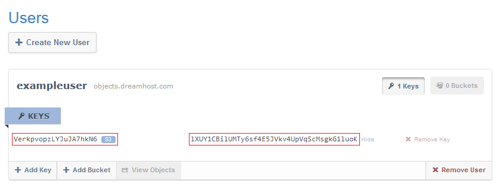

What are Keys in DreamObjects and How Do You Use Them?
======================================================

Keys
~~~~

Each user has at least one Key Pair set which consists of the following:

* a 20 character Access Key (similar to a username for a bucket), and
* a 40 character Secret Key (similar to a password for a bucket and
  automatically generated).

The panel uses these credentials to access your buckets and objects, or in the
case of Swift, to obtain a Swift token for future access.

To view your keys, click on your username:

* Most third party clients like Cyberduck, as well as APIs and tools that are
  written using the API, also use these credentials to gain access to the
  DreamObjects programmatic cluster.
* A user can have multiple keys to provide fine grain access.
* Removing a key pair removes access for any application using it.

Copying your Access Key
-----------------------

As a convenience, when you click an Access Key or Secret Key the text is
selected (though not copied to the clipboard). Once the key is highlighted, you
can copy it by clicking **CTRL + C** on your keyboard and then paste it by
clicking **CTRL + V**.

Adding a Key Pair
-----------------

1. Either collapse your User object, or scroll to the bottom of your expanded
   User object to find the User Controls.

    .. figure:: images/07_DHO_End_User_Guide.fw.png

2. Click the **Add Key** button.
    *A drop-down list appears allowing you to choose S3 or Swift:*

    .. figure:: images/08_DHO_End_User_Guide.fw.png

3. Select either S3 or Swift.
    * If you select S3, proceed to Step 5.
    * If you select Swift, an additional field appears indicating that you
      must create a Sub-user name. DreamObjects Sub-users have full control,
      and are used in combination with the Secret Key to obtain a Swift token
      for future access.

    .. figure:: images/09_DHO_End_User_Guide.fw.png

4. Enter a Sub-user name.
5. Click the **Add Access Key** button.
    *An Access Key is added.*

Deleting a Key Pair
-------------------

1. Navigate to the Key Pair you wish to delete and then locate the Remove Key
   button on the right-hand side of that row.

    .. figure:: images/10_DHO_End_User_Guide.fw.png

2. Click the **Remove Key** button.
    *A confirmation dialog box opens:*

    .. figure:: images/11_DHO_End_User_Guide.fw.png

.. important::

    Deleting the Key Pair will result in a loss of access for all
    clients and scripts that have been using that Key Pair.

3. Click the **Remove** button.
    *The Key Pair is deleted.*

.. meta::
    :labels: key
