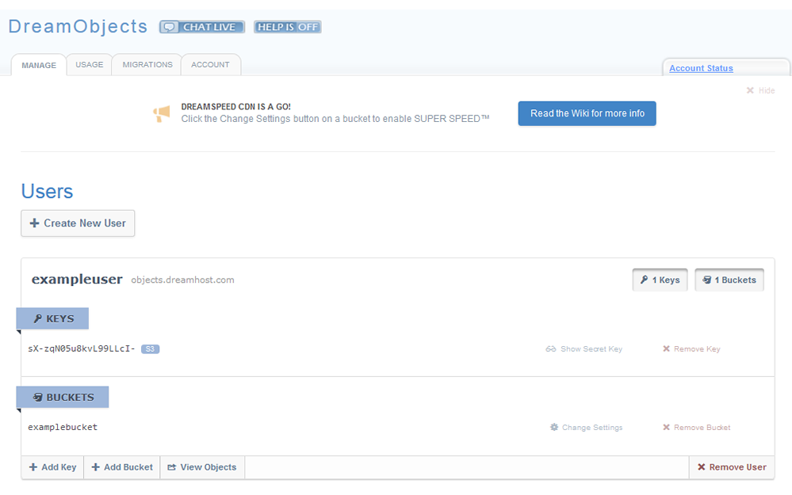
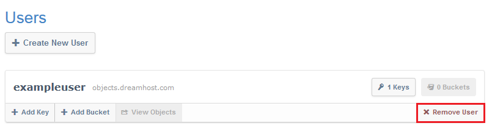
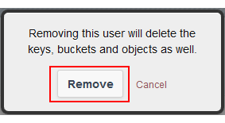

What are Users in DreamObjects and How Do You Use Them?
=======================================================

Users
~~~~~

* DreamObjects Users are added separately, and are distinct from any other users
  in the panel.
* Users can have more than one set of keys so that access can be granted or
  revoked.
* Users can also have have multiple buckets.

Navigating to DreamObjects to view your user list
-------------------------------------------------

1. Navigate to the (`Panel > ‘Could Services’ > ‘DreamObjects’
   <https://panel.dreamhost.com/index.cgi?tree=cloud.objects&>`_) page in your
   DreamHost panel.
2. Click the ‘Manage’ tab at the top.

    *The DreamObjects page opens which displays a list of Users:*

Creating a User
---------------

1. Click the **Create New User** button on the ‘Manage’ tab of the DreamObjects
page.

    .. figure:: images/03_DHO_End_User_Guide.fw.png

2. Enter a username in the Username field.

    * Usernames should contain characters, numbers, dashes, dots, and underscores
      only, and are unique on the cluster.
3. Click the **Add User** button.

Editing a User
--------------

You can add Keys and Buckets to User objects, however you cannot change any
User properties such as the username.

Deleting a User
---------------

1. Navigate to the (`Panel > ‘Could Services’ > ‘DreamObjects’
   <https://panel.dreamhost.com/index.cgi?tree=cloud.objects&>`_) page in your
   DreamHost panel.
2. Click the ‘Manage’ tab at the top.

    *The DreamObjects page opens where a list of Users displays.*

3. Locate the user you wish to delete

    *A 'Remove User' link appears on the bottom right of the user object:*

4. Click the **Remove User** button.

    *A confirmation dialog box opens:*

.. important::

    Deleting a User will also permanently remove all data owned by the
    User. Although DreamHost attempts to preserve the last 5 days-worth of
    data, there is no guarantee that any data from a deleted user can be
    recovered!

5. If you are certain that you wish to permanently delete the user, click
   **Remove** on the confirmation dialog box.

    *The user is deleted.*

.. meta::
    :labels: authentication
