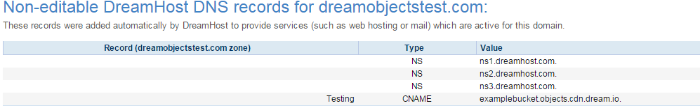

==================================================
How to create a DNS alias for DreamObjects buckets
==================================================

Overview
~~~~~~~~

DreamObjects allows you to create aliases that point to your buckets using
CNAME records. For example, you can use a CNAME record to map a DreamHost.com
bucket URL to a domain under your control, like media.example.com. Using a
CNAME record in this way makes your links look more professional as they do
not show the full 'objects.dreamhost.com' portion of the URL.

Examples of CNAME records and bucket
------------------------------------

+-----------------------------------------------------------+-------------------------------------------------------------------------------------+
| CNAME Record                                              | DH Bucket to which it points                                                        |
+-----------------------------------------------------------+-------------------------------------------------------------------------------------+
| `bucket.mwod.net <http://bucket.mwod.net>`_               | `bucket.objects.dreamhost.com <http://bucket.objects.dreamhost.com>`_               |
+-----------------------------------------------------------+-------------------------------------------------------------------------------------+
| `bucket.mwod.net/object <http://bucket.mwod.net/object>`_ | `bucket.objects.dreamhost.com/object <http://bucket.objects.dreamhost.com/object>`_ |
+-----------------------------------------------------------+-------------------------------------------------------------------------------------+

.. note::

    If you're using a third-party DNS, be sure to manually copy the CNAME from
    the panel to the nameservers since it won't automatically propagate.

Adding a DreamObjects CNAME record
~~~~~~~~~~~~~~~~~~~~~~~~~~~~~~~~~~

You can create, delete and modify your DreamObjects CNAME records within the
panel using the built in interface. The interface includes:

    * A section for permissions
    * A link to the bucket
    * A section for setting up aliases as subdomains of domains on the Account

1. Navigate to the `(Panel > Cloud Services’ > ‘DreamObjects’
   <https://panel.dreamhost.com/index.cgi?tree=cloud.objects&>`_) page.

    .. figure:: images/01_DreamSpeed_CDN.fw.png

2. To the right of your bucket, click the ‘Change Settings’ link.

    .. figure:: images/02_DreamObjects_CNAME.png

3. Toggle the permissions option to either 'PRIVATE' or 'PUBLIC'.
4. Enter your alias and choose the domain you wish to assign this to.
5. Click the **Save Settings** button to save.

.. note:: In the screenshot above there are two CDN options also enabled

Linking a file using the CNAME record
~~~~~~~~~~~~~~~~~~~~~~~~~~~~~~~~~~~~~

The following example uses the CNAME about (testing.dreamobjectstest.com) to
link an image file:

.. code::

    http://testing.dreamobjectstest.com/image.png

If your image is in a subdirectory (in DreamObjects), you must specify the
full path. This example shows that the image.png file is in the /savedimages/
folder.

.. code::

    http://testing.dreamobjectstest.com/savedimages/image.png

CNAME example
~~~~~~~~~~~~~

Once the record is created, you can see it on the `(Panel > 'Domains' >
'Manage Domains' <https://panel.dreamhost.com/index.cgi?tree=domain.manage&>`_)
page. Click the 'DNS' link under your domain to view the record:

.. meta::
    :labels: dns bucket
