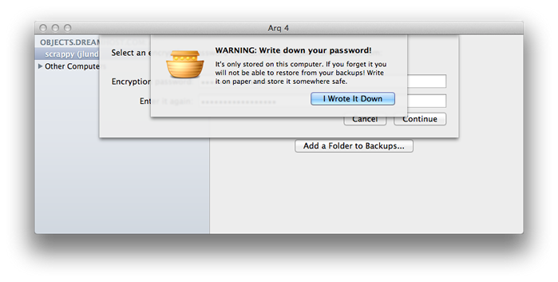

================================
How to Use Arq with DreamObjects
================================

Overview
~~~~~~~~

.. figure:: images/Arq-icon.png

`Arq <https://www.arqbackup.com>`_ is a Mac and Windows app that allows you to
make online backups that supports DreamObjects. Arq backups are encrypted with
a password before they're uploaded so your data is protected.

Connecting with Arq
~~~~~~~~~~~~~~~~~~~

1. Launch Arq.
    *When launching Arq for the first time, you are prompted to choose your
    backup destination:*

.. figure:: images/Arq-1.fw.png

2. Select 'DreamObjects' from the drop down list and then click **Continue**.
    *The DreamObjects access key and secret key request page opens:*

.. figure:: images/Arq-2.fw.png

3. Click the **Retrieve DreamObjects Keys** button which opens your
   DreamObjects page in the DreamHost panel. Visit the following article for
   further information:

    * DreamObjects_End_User_Guide

.. figure:: images/Arq-3.fw.png

4. After you enter the DreamObjects access Key and secret Key, enter a new
   bucket name or select an existing bucket from the drop down list.

.. figure:: images/Arq-4.fw.png

5. After you authenticate Arq with DreamObjects, select one of the following
   to back up:

    * The entire home directory, or
    * Manually select folders.

.. figure:: images/Arq-5.fw.png

6. Create an encrypted password for your backup which allows additional
   security to the backup created.

7. After you enter an encrypted password, be sure to write down the password
   you created and store it somewhere safe.

    *Arq is now configured to backup your data:*

.. figure:: images/Arq-7.fw.png

.. meta::
    :labels: arq windows mac backup
