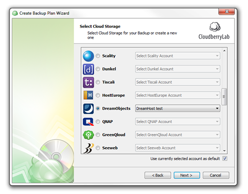
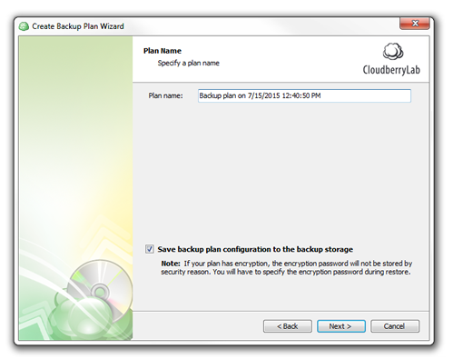
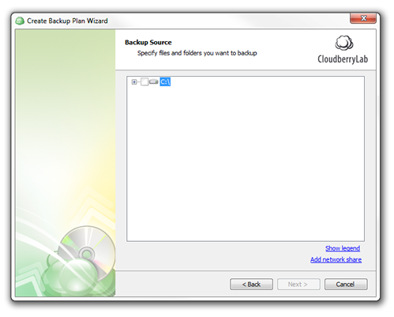
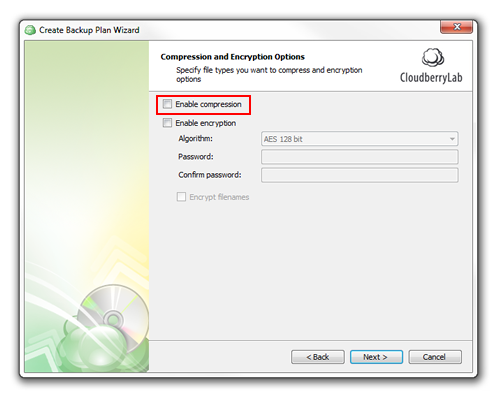
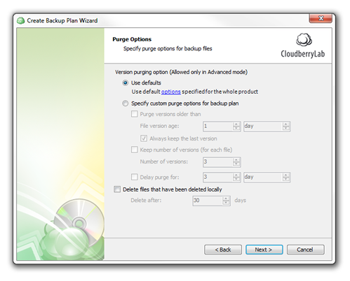
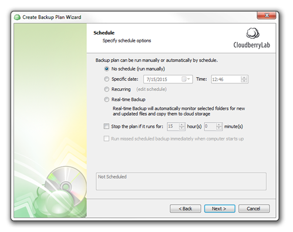
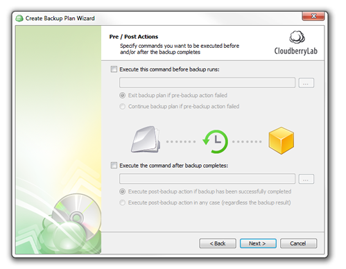

==============================================
How to Use CloudBerry Backup with DreamObjects
==============================================

Overview
~~~~~~~~

.. figure:: images/Banner cloudberry1.png

`CloudBerry Backup <http://www.cloudberrylab.com/dreamobjects-tools.aspx>`_ is a Windows program that automates encrypted and compressed data cloud backup. 

This guide describes how to configure CloudBerry with DreamObjects.

Setting up CloudBerry Backupup with DreamObjects
~~~~~~~~~~~~~~~~~~~~~~~~~~~~~~~~~~~~~~~~~~~~~~~~

1. Launch CloudBerry.

.. figure:: images/01_Cloudberry.fw.png

2. Select the ‘Setup Backup Plan’ option.

.. figure:: images/02_Cloudberry.fw.png

3. Click the **Next** button.

.. figure:: images/03_Cloudberry.fw.png

4. In the ‘Select Cloud Storage’ window, select the ‘DreamObjects’ option and then ‘<Create a new account>’.

.. figure:: images/04_Cloudberry.fw.png

5. Enter the following  DreamObjects credentials which can be found on the (`Panel > ‘Cloud Services’ > ‘DreamObjects’ <https://panel.dreamhost.com/index.cgi?tree=cloud.objects>`_) page:

    * **Display Name** – Enter any name you wish
    * **Access Key** – Under the username on the DreamObjects page for the specific bucket name
    * **Secret Key** – To the left of the Access Key (also known as the password)
    * **Service Point** – objects.dreamhost.com

    .. note:: After entering the required information, users are able to both access existing buckets and create new ones.

    *The new DreamObjects account now appears on the ‘Select Cloud Storage’ window:*

6. Click the **Next** button.

7. Enter a backup 'Plan name'.

.. figure:: images/07_Cloudberry.fw.png

8. Select a backup mode.

.. figure:: images/08_Cloudberry.fw.png

9. Select whether you wish to use VSS (Volume Shadow Copy Service).

10. Select the location of the files and folders you wish to backup.

.. figure:: images/10_Cloudberry.fw.png

11. In the ‘Advanced Filter’ window, select whether to backup all files or specific types along with your choice of time frame. 

12. Check the check box to ‘Enable compression’.
    * You can also enable encryption if you want.

13. Select any Purge options you wish to set up.
    * Some Purge options aren't available unless ‘Advanced Mode’ is enabled.

14. Select time schedule options for your backups.

15. Select whether you want to set pre or post actions for your backups.
    * You can skip this step if you like by clicking the **Next** button.

.. figure:: images/15_Cloudberry.fw.png

16. Select how you wish to be notified regarding the status of a backup.
    * Include your email address in the email field

.. figure:: images/16_Cloudberry.fw.png

17. Confirm the settings on the summary page, and then click the **Next** button.
    *A confirmation page appears:*

.. figure:: images/17_Cloudberry.fw.png

* You can run the backup now by checking the box, or you can click **Finish** to run it a later time.

.. figure:: images/18_Cloudberry.fw.png

18. Click the ‘Backup Plans’ tab to confirm everything is properly configured.
19. Click the **Run backup now** button if you want to run the backup.
