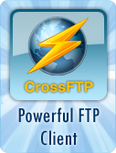

=====================================
How to Use CrossFTP with DreamObjects
=====================================

Overview
~~~~~~~~

`CrossFTP <http://www.crossftp.com/>`_ is a powerful FTP and S3 client that you can use to connect to DreamHost’s DreamObjects service. It is available on Windows, Mac, and Linux. This article describes how to connect to your DreamObjects account using CrossFTP.

Connecting to CrossFTP with DreamObjects
~~~~~~~~~~~~~~~~~~~~~~~~~~~~~~~~~~~~~~~~

To set up CrossFTP to use with your DreamObjects account:

1. Open CrossFTP and select Site Manager. You can do this by clicking the ‘Sites’ tab and selecting ‘Site Manager’, or by clicking F9 on your keyboard.

    .. figure:: images/01_CrossFTP.fw.png

2. Select a Category in the left window pane. For example, click the ‘Default’ folder.
3. Click the **New Site** button on the bottom left. A pop-up window opens.

    .. figure:: images/02_CrossFTP.fw.png

4. Enter the following settings within the General tab:
    * **Protocol**: Select ‘S3’ from the drop down list.
    * **Label**: DreamObjects <Bucket_Name_Here> (In this example, the bucket name is ‘bucketexample’.)
    * **Host**: objects.dreamhost.com
    * **Port**: 80
    * **Access Key** and **Secret**: You can find your access/secret key within the (`Panel > ‘Cloud Services’ > ‘DreamObjects’ <https://panel.dreamhost.com/index.cgi?tree=cloud.objects&>`_) section of the panel. Click on your DreamObjects username, and then the access key appears below it along with the secret key to the right:

    .. figure:: images/03_CrossFTP.fw.png

    * **Remote Path**: <Bucket_Name_Here> (In this example, the remote path is ‘bucketexample’.)

5. When finished entering the above settings, click the **Apply** button.
6. Click the **Connect** button to connect to DreamObjects.

CrossFTP will then connect to your DreamObjects bucket.
