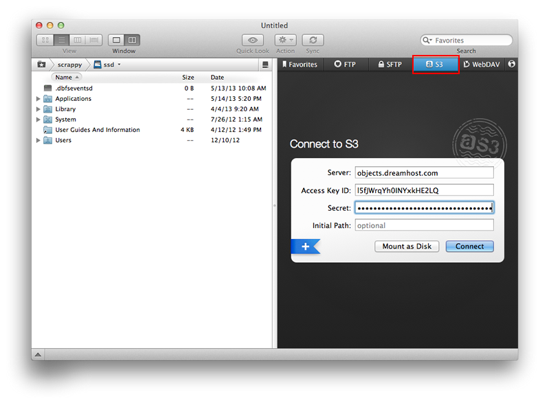
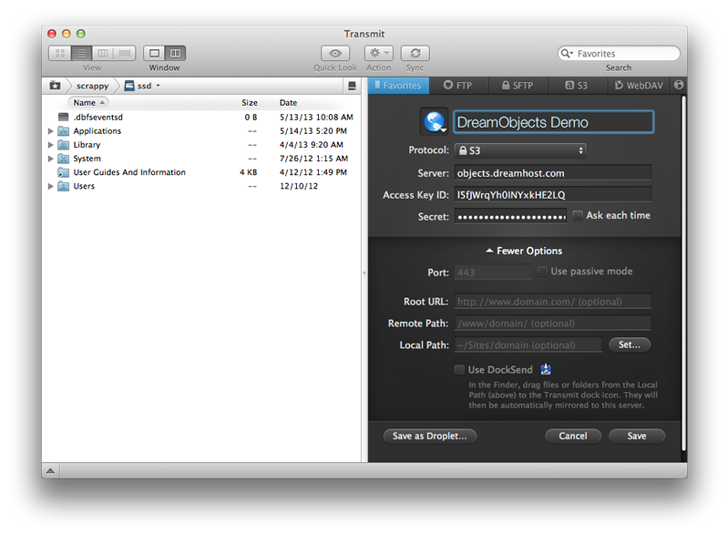
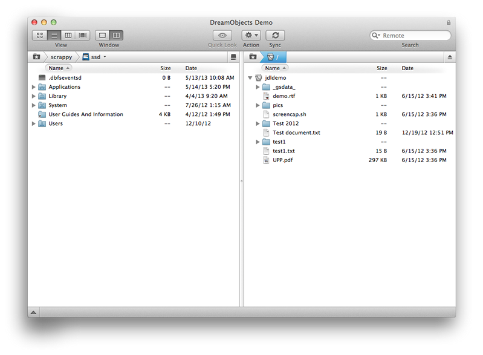

=====================================
How to Use Transmit with DreamObjects
=====================================

Overview
~~~~~~~~

`Transmit <http://panic.com/transmit/>`_ is an FTP client for Mac OS X
developed by Panic which also includes capabilities to mount SFTP, Amazon S3,
and WebDAV connections. The client is a shareware so it's free to evaluate but
after the trial period is over you’re limited to seven-minute sessions.

This guide describes how to use Transmit to mount your DreamObject buckets.

For more information, please visit the Transmit website:

* http://www.panic.com/transmit/

Using Transmit with DreamObjects
~~~~~~~~~~~~~~~~~~~~~~~~~~~~~~~~

Before you begin, make sure you already have a `DreamObjects bucket`_ created.

DreamObjects connectivity is available in version 4.4+ of Transmit. Download
the latest release from `Panic's site <http://panic.com/transmit/>`_ or from
the `Mac App Store
<https://itunes.apple.com/us/app/transmit/id403388562?mt=12>`_.

1. Launch Transmit.

2. Select S3 on the right side as the connection type.

3. Enter the following:
    * **Server:**  objects.dreamhost.com
    * **Access Key ID:** Your Access Key
    * **Secret:** Your Secret Key
    * **Initial Path:** Leave blank

.. note::

    Visit the `DreamObjects keys guide`_ for
    instructions on how to find your access and secret keys.

4. Click the plus (**+**) button on the lower-left to save it as a favorite

5. Enter a name for your favorite, and then click the **Save** button to save
   it.

    *Upon connecting to DreamObjects, the buckets you've created and the data
    within them appear on the right side:*

.. _DreamObjects bucket: 215321178-What-are-Buckets-in-DreamObjects-and-How-Do-You-Use-Them-

.. _DreamObjects keys guide: 215986357-What-are-Keys-in-DreamObjects-and-How-Do-You-Use-Them-
